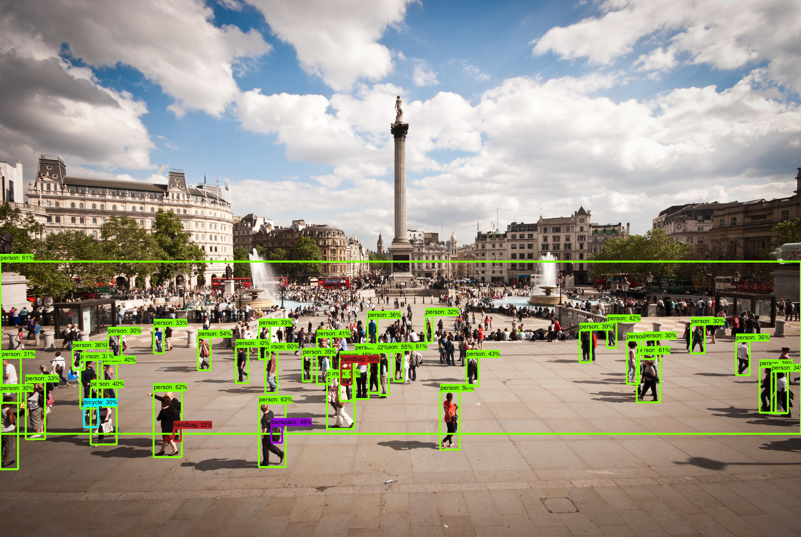
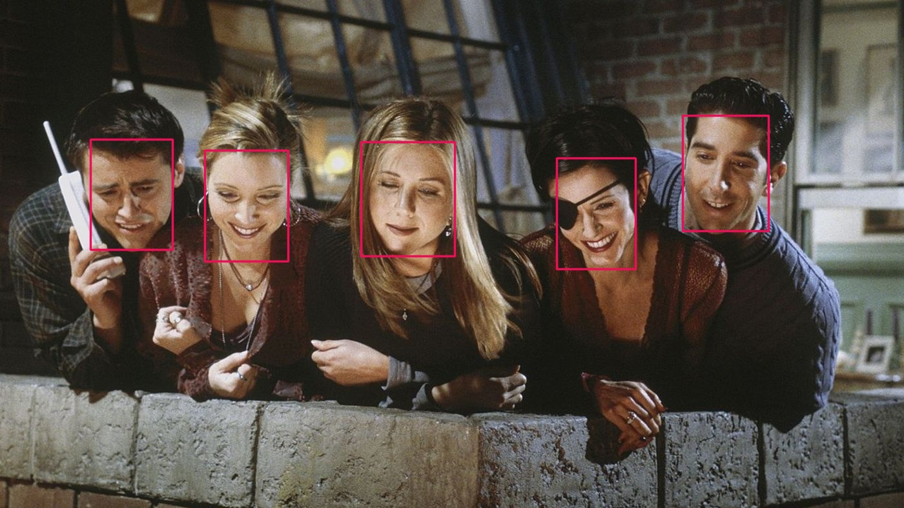
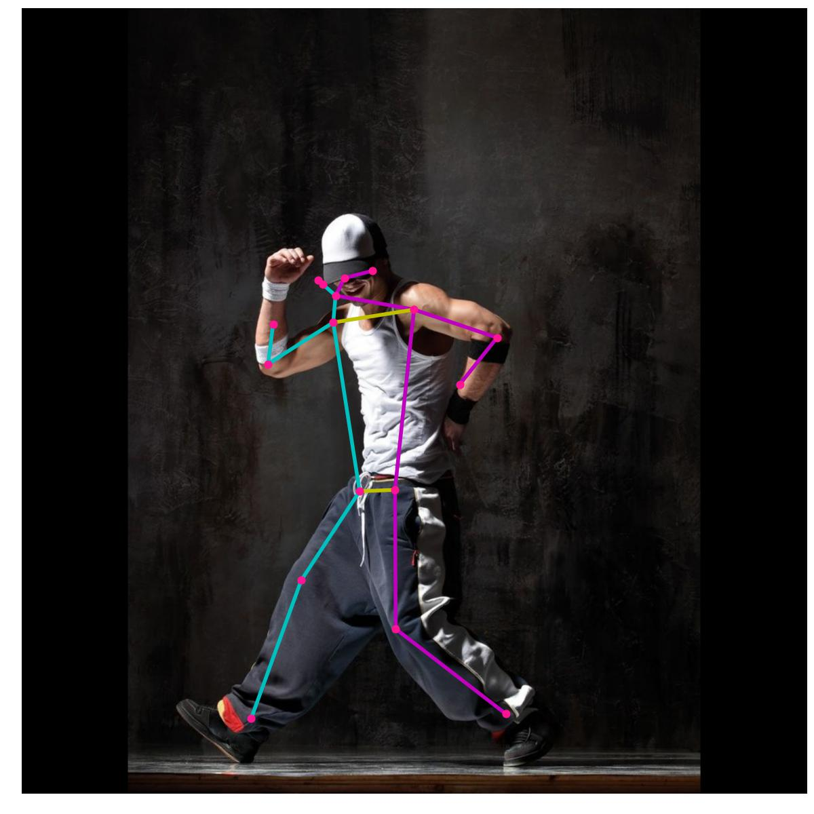
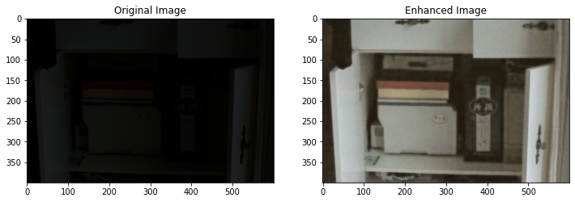

Here you can find the list of models available.

## Image Classification
---
### Model: NASNetLarge
Category: Image Classification

**Class:** readyml.imageclassification.NASNetLarge

**Reference:** [Learning Transferable Architectures for Scalable Image Recognition (CVPR 2018)](https://arxiv.org/abs/1707.07012)

**Example of use:**
```python
from readyml import imageclassification as ric
import PIL.Image as Image

## Read an image
image_pil = Image.open("../images/greek_street.jpeg")

## Instantiate the model class
nasnetlarge = ric.NASNetLarge()
## Get categories with a confidence score equal or above 30%
results = nasnetlarge.infer(image_pil, threshold=30)
print(results)
```
**Results:** The labels and its percent accuracy.
```json
[
    {
        "label": "monastery",
        "score": 38.63
    }
]
```

---
### Model: MobileNetV2
Category: Image Classification

**Class:** readyml.imageclassification.MobileNetV2


---
### Model: InceptionV3
Category: Image Classification

**Class:** readyml.imageclassification.InceptionV3


---
### Model: Resnet50
Category: Image Classification

**Class:** readyml.imageclassification.Resnet50


---
### Model: Resnet152x4
Category: Image Classification

**Class:** readyml.imageclassification.Resnet152x4


---
## Object Detection
---
### Model: Hourglass 512x512
Category: Object Detection

**Class:** readyml.objectdetection.HourGlass_512x512

**Reference:** []()



**Example of use:**
```python
from readyml import objectdetection as rod
import PIL.Image as Image

## Read an image
image_pil = Image.open("./images/trafalgar.jpg")

## Instantiate the model class
model = rod.HourGlass_512x512()

preds, image = model.infer(image_pil)
im = Image.fromarray(image)
im.save("trafalgar.jpg")

print(preds)
```
**Results:** An array of found objects, with the object's label, score, and bounding box coordinates.
```json
[
    {
        "box": [
            1111,
            2219,
            570,
            3696
        ],
        "label": "person",
        "score": 96.78
    },
    {
        "box": [
            2134,
            2842,
            925,
            3666
        ],
        "label": "person",
        "score": 85.62
    }
]

```
---
### Model: Hourglass 1024x1024
Category: Object Detection

**Class:** readyml.objectdetection.HourGlass_1024x1024


---
### Model: Resnet50 v1 fpn 512x512
Category: Object Detection

**Class:** readyml.objectdetection.Resnet50v1Fpn_512x512


---
### Model: Resnet101 v1 fpn 512x512
Category: Object Detection

**Class:** readyml.objectdetection.Resnet101v1Fpn_512x512


---
### Model:
Category: Object Detection

**Class:** readyml.objectdetection.


---
### Model: Resnet50 v2 512x512
Category: Object Detection

**Class:** readyml.objectdetection.Resnet50v2_512x512


---
### Model: Efficientdet D0
Category: Object Detection

**Class:** readyml.objectdetection.EfficientdetD0


---
### Model: Efficientdet D1
Category: Object Detection

**Class:** readyml.objectdetection.EfficientdetD1


---
### Model: Efficientdet D2
Category: Object Detection

**Class:** readyml.objectdetection.EfficientdetD2


---
### Model: Efficientdet D3
Category: Object Detection

**Class:** readyml.objectdetection.EfficientdetD3


---
### Model: Efficientdet D4
Category: Object Detection

**Class:** readyml.objectdetection.EfficientdetD4


---
### Model: Efficientdet D5
Category: Object Detection

**Class:** readyml.objectdetection.EfficientdetD5


---
### Model: Efficientdet D6
Category: Object Detection

**Class:** readyml.objectdetection.EfficientdetD6


---
### Model: Efficientdet D7
Category: Object Detection

**Class:** readyml.objectdetection.EfficientdetD7


---
### Model: SsdMobilenet v2
Category: Object Detection

**Class:** readyml.objectdetection.SsdMobilenetv2


---
### Model: SsdMobilenet v1 Fpn 640x640
Category: Object Detection

**Class:** readyml.objectdetection.SsdMobilenetv1Fpn_640x640


---
### Model: SsdMobilenet v2 Fpn Lite 320x320
Category: Object Detection

**Class:** readyml.objectdetection.SsdMobilenetv2FpnLite_320x320


---
### Model: Resnet50 v1 Fpn 640x640
Category: Object Detection

**Class:** readyml.objectdetection.Resnet50V1Fpn_640x640


---
### Model: Resnet50 v1 Fpn 1024x1024
Category: Object Detection

**Class:** readyml.objectdetection.Resnet50v1Fpn_1024x1024


---
### Model: Resnet101 v1 Fpn 640x640
Category: Object Detection

**Class:** readyml.objectdetection.Resnet101v1Fpn_640x640


---
### Model: Resnet101 v1 Fpn 1024x1024
Category: Object Detection

**Class:** readyml.objectdetection.Resnet101v1Fpn_1024x1024


---
### Model: Resnet152 v1 Fpn 640x640
Category: Object Detection

**Class:** readyml.objectdetection.Resnet152v1Fpn_640x640


---
### Model: Resnet152 v1 Fpn 1024x1024
Category: Object Detection

**Class:** readyml.objectdetection.Resnet152v1Fpn_1024x1024


---
### Model: FasterRcnn Resnet50 v1 640x640
Category: Object Detection

**Class:** readyml.objectdetection.FasterRcnnResnet50v1_640x640


---
### Model: FasterRcnn Resnet50 v1 1024x1024
Category: Object Detection

**Class:** readyml.objectdetection.FasterRcnnResnet50v1_1024x1024


---
### Model: FasterRcnn Resnet50 v1 800x1333
Category: Object Detection

**Class:** readyml.objectdetection.FasterRcnnResnet50v1_800x1333


---
### Model: FasterRcnn Resnet101 v1 640x640
Category: Object Detection

**Class:** readyml.objectdetection.FasterRcnnResnet101v1_640x640


---
### Model: FasterRcnn Resnet101 v1 1024x1024
Category: Object Detection

**Class:** readyml.objectdetection.FasterRcnnResnet101v1_1024x1024


---
### Model: FasterRcnn Resnet101 v1 800x1333
Category: Object Detection

**Class:** readyml.objectdetection.FasterRcnnResnet101v1_800x1333


---
### Model: FasterRcnn Resnet152 v1 640x640
Category: Object Detection

**Class:** readyml.objectdetection.FasterRcnnResnet152v1_640x640


---
### Model: FasterRcnn Resnet152 v1 1024x1024
Category: Object Detection

**Class:** readyml.objectdetection.FasterRcnnResnet152v1_1024x1024


---
### Model: FasterRcnn Resnet152 v1 800x1333
Category: Object Detection

**Class:** readyml.objectdetection.FasterRcnnResnet152v1_800x1333


---
### Model: FasterRcnn Inception Resnetv2 640x640
Category: Object Detection

**Class:** readyml.objectdetection.FasterRcnnInceptionResnetv2_640x640


---
### Model: FasterRcnn Inception Resnetv2 1024x1024
Category: Object Detection

**Class:** readyml.objectdetection.FasterRcnnInceptionResnetv2_1024x1024


---
### Model: MaskRcnn Inception Resnet v2 1024x1024
Category: Object Detection

**Class:** readyml.objectdetection.MaskRcnnInceptionResnetv2_1024x1024


---
## Image Generation
---
### Model: BigGanDeep 128
Category: Image Generation

**Class:** readyml.objectdetection.BigGanDeep128

**Example of use:**
```python
from readyml import imagegeneration as rig
import PIL.Image as Image

category = 356

model = rig.BigGanDeep128()

new_image = model.infer(category)

im = Image.fromarray(new_image[0])
im.save("myimage.jpeg")
```
**Result:** A generated image


---
### Model: BigGanDeep 256
Category: Image Generation

**Class:** readyml.objectdetection.BigGanDeep256

---
### Model: BigGanDeep 512
Category: Image Generation

**Class:** readyml.objectdetection.BigGanDeep512

---
### Model: BigGan 128
Category: Image Generation

**Class:** readyml.objectdetection.BigGan128

---
### Model: BigGan 256
Category: Image Generation

**Class:** readyml.objectdetection.BigGan256

---
### Model: BigGan 512
Category: Image Generation

**Class:** readyml.objectdetection.BigGan512

---
## Face Generation

---
### Model: Progan 128
Category: Face Generation

**Class:** readyml.facegeneration.FaceGeneration

**Example of use:**
```python
from readyml import facegeneration as rfg
import PIL.Image as Image

model = rfg.FaceGeneration()

image = model.infer(num_samples=30)[0]

image = Image.fromarray(image.numpy())
image.save("myimage.jpeg")
```
**Result:** A generated face image

---
## Face Detection

---
### Model: Light Face Detection
Category: Face Detection

**Class:** readyml.facedetection.FaceDetection



**Reference:** https://github.com/borhanMorphy/light-face-detection

**Example of use:**
```python
from readyml import facedetection as rfd
import imageio

img = imageio.imread("../images/faces.jpg")[:,:,:3]

model = rfd.FaceDetectionModel()
preds = model.infer(img)
print(preds)
```
**Result:** Bouding boxes coordinates and confidence scores
```
[
    {
        "box": [
            46,
            19,
            88,
            70
        ],
        "score": 100.0
    },
    {
        "box": [
            94,
            95,
            133,
            146
        ],
        "score": 100.0
    },
    {
        "box": [
            207,
            44,
            253,
            106
        ],
        "score": 100.0
    }
]
```

---
## Pose Detection

---
### Model: Movenet Singlepose Lightning
Category: Pose Detection

**Class:** readyml.posedetection.MovenetSingleposeLightning



**Example of use:**
```python
from readyml import posedetection as rpd
import PIL.Image as Image

## Read an image
image_pil = Image.open("../images/movenet-singlepose-lightning.jpg")

## Instantiate the model class
model = rpd.MovenetSingleposeLightning()

keypoint_with_scores = model.infer(image_pil)

new_image = model.draw(image_pil, keypoint_with_scores)
im = Image.fromarray(new_image)
im.save("pose-detection.jpeg")

print(keypoint_with_scores)
```
**Result:** The original image with the keypoints

---
## Image Super Resolution

---
### Model: Enhanced Super Resolution GAN
Category: Image Super Resolution

**Class:** readyml.imagerestoration.MIRNet


**Example of use:**
```python
from readyml import superresolution as rsr
import PIL.Image as Image
import tensorflow as tf

# Read an image
image_pil = Image.open("../images/lowres.jpg")

# Instantiate the model class
model = rsr.ESRgan()

image = model.infer(image_pil)

tf.keras.preprocessing.image.save_img("highres.jpg", image)
```

---
## Image Restoration

---
### Model: MRNet
Category: Image Restoration

**Class:** readyml.imagerestoration.MIRNet



**Example of use:**
```python
from readyml import imagerestoration as rir
import PIL.Image as Image

# Read an image
image_pil = Image.open("../images/mirnet.jpg")

# Instantiate the model class
model = rir.MIRNet()
new_image = model.infer(image_pil)

new_image.save("restored_image.jpg")
```
